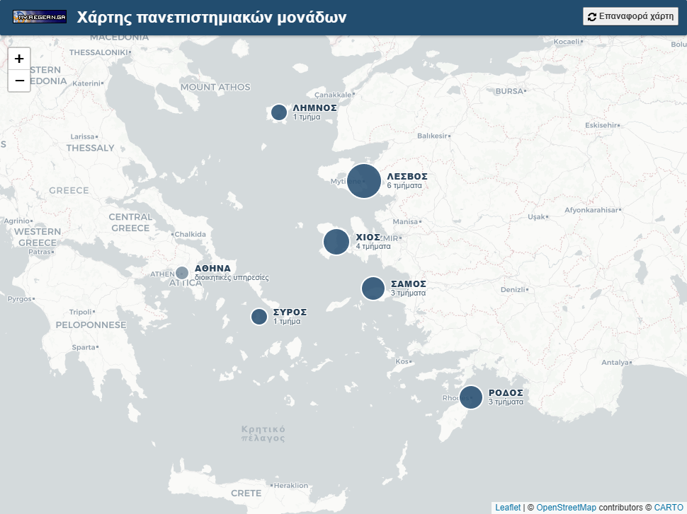

Map of University of the Aegean
===========

This project serves as a quick view on the 6 university units on the Aegean Archipelago, Greece.

---------------------------------------

## About /map/

### A quick view over the university units

This map application consists of 7 pointers that show some info &amp; details regarding the <a href="http://www.aegean.gr" target="_blank" title="University of the Aegean">University of the Aegean</a> infrastructure. A visitor can see some information related to the specific schools/departments (official sites) as well as some forum discussions on the student community of My.Aegean.gr that also relate to the specific schools/departments. There is also a pointer that zooms into the unit that is situated in Athens, a building that includes administration services and offices. This is a static map application, that can be expanded to include some interactive material and services as well

<strong>Fork it!</strong> We encourage the optimization and development of this simple idea by expanding its possibilites and serving as a point of reference and providing fruitful information regarding the university units. Please feel free to contribute here and support it further!

We will support the expansion of the project and update it on: <strong><a href="http://my.aegean.gr/map/" target="_blank">my.aegean.gr/map/</a></strong> 

 

---------------------------------------

## Under the hood — third generation, 2026

The map above is the third implementation to live at `/map/`. The URL has stayed
the same across all three; what runs behind it has not.

| Generation | Stack | Fate |
|---|---|---|
| 1st, 2010 | Google Maps JavaScript API **v2** | Deprecated by Google |
| 2nd, 2017–2021 | v2 loader shimmed with a v3 key | Broke — the key lapsed and the page went blank |
| 3rd, 2026 | Leaflet + CARTO, no key | Current |

Screenshots of the earlier generations are kept in this repository as
`AegeanUniversity-GR-MapView.png` and `AegeanUniversity-GR-GMapView.png`.

### Zero dependencies, by design

No API key. No account. No server-side execution. Nothing to build before you can
publish it — you deploy by copying files onto any static host.

The map is [Leaflet](https://leafletjs.com/) 1.9.4, loaded from cdnjs with
Subresource Integrity, over [CARTO Positron](https://carto.com/basemaps/) tiles.
Both are free for this kind of use and neither asks for a key. That constraint is
the whole point of this generation: the previous one died quietly when its key
lapsed, and we would rather it did not happen again.

### Files

    index.html          the entire application — markup, CSS, JS, SVG icons
    map-data.json       the single source of truth for all map content
    map-data.js         generated mirror of the JSON, for file:// previewing
    build-datajs.py     regenerates map-data.js from map-data.json
    img/                unit photos and marker icons

`index.html` fetches `map-data.json` when served over http(s). Browsers block that
fetch under the `file://` protocol, so the page falls back to `map-data.js`, which
assigns the same object to `window.MAP_DATA`. Keeping both is what lets the map be
previewed by double-clicking the file, with no server and no terminal.

### Editing the content

Edit `map-data.json` only, then regenerate the mirror:

    python build-datajs.py

Never hand-edit `map-data.js` — the next build overwrites it. A unit entry looks
like this:

    {
      "id": "syros",
      "name": "ΣΥΡΟΣ",
      "coords": [37.44, 24.94],
      "zoom_on_click": 12,
      "icon": "img/icon-syros.png",
      "photo": "img/syros.jpg",
      "photo_focus": "50% 60%",
      "departments": [ { "name": "…", "url": "https://…" } ],
      "links": [ { "label": "…", "url": "https://…", "icon": "photos" } ]
    }

Available `icon` keys for links are `dept`, `photos`, `teams` and `uni`; the SVG
paths live at the top of the script block in `index.html`.

### A note on the data

The unit and department listings originate as a **snapshot of 2021**, and they
have held up better than expected. In August 2026 all eighteen department links
were checked one by one: every one of them resolves to its official page on
aegean.gr, over HTTPS, with no redirects. Only a single entry had drifted in five
years — Mediterranean Studies in Rhodes, since renamed to "Τμήμα Μεσογειακών
Σπουδών: Αρχαιολογία, Γλωσσολογία, Διεθνείς Σχέσεις" — and it has been updated
here, name and URL both.

The listings are not automatically maintained, though, so treat them as a record
that happens to be current rather than one guaranteed to stay so. Keeping them
that way is exactly the contribution we would most welcome.

### Attribution

Map tiles © [CARTO](https://carto.com/attributions), map data ©
[OpenStreetMap](https://www.openstreetmap.org/copyright) contributors, released
under the ODbL. Leaflet is BSD-2-Clause licensed.

Leaflet 1.8 and later inject a national flag into the attribution control. This
page hides that graphic with CSS, purely to keep a university map politically
neutral. The attribution text and links themselves are untouched, so the licence
terms are met in full.

---------------------------------------

## About MyAegean

The idea of <em>"my Aegean"</em> originated in 2002 with a group of students from the University of the Aegean. The aim of this initiative was to create a network portal for the whole of the Aegean University community by utilising any available technology. Our aspiration is to create <strong>a vehicle which will encourage and promote direct, collective and qualitative communication and information exchange, without geographical restrictions, among all members of the Aegean community</strong> (students, academic and research staff, as well as administrative, technical or other personnel). <em>myAegean</em> is to serve as a common point of reference, as a scheme which will stimulate and facilitate interaction among all the members of the university.

## Support

